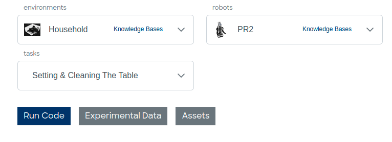

<h1 align=center>Virtual Research Building (ViB) | <a href="https://intel4coro.github.io/ViB-public/" rel="nofollow">Live Demo</a></h1>

Interactive Research Space pages built with markdown files powered by site generator [Hugo](https://gohugo.io/).
> This site is based on hugo theme [beautifulhugo](https://github.com/halogenica/beautifulhugo).


## Contribute

To contribute to the content of the website, do the following steps:

  1. Create your own fork of the repository, see [Fork A Repo](https://docs.github.com/en/get-started/quickstart/fork-a-repo) for details.
  2. Clone the files of your fork repository to your local computer (see also fork page for details).
  3. Open a terminal in the newly created project directory and follow the "Installation" instructions to setup and start a local hugo server.
  4. Go to your directory in "content/posts" and edit the "index.md" file to change the corresponding web page according to your wishes.
  5. Commit changes to the (fork) repository
  6. After all changes and redesigns are finalized, start a pull request to transfer the fork changes to the main repository, see [Creating A Pull Request](https://docs.github.com/en/pull-requests/collaborating-with-pull-requests/proposing-changes-to-your-work-with-pull-requests/creating-a-pull-request) for details.

Notes:

  * Use the localhost function as a preview to check that all links, images and videos work and that the overall design looks good.
  * To embed a YouTube-Video correctly, the ***embedded*** link must be used. Go to YouTube-Video -> "Share"-button -> "Embed" -> Use the iframe link


## Installation

### 1. Init git submodule to add hugo theme

```bash
git submodule update --init
```

### 2. Install Hugo

* On Linux Debian run command:
  ```bash
  sudo apt install hugo
  ```
* See [the Hugo documentation](https://gohugo.io/installation/) for details.

### 3. Start Hugo

* Run command:
  ```bash
  hugo server --buildDrafts
  ```
  to start a local dev Hugo server with adress: [http://localhost:1313/coai-vib/]()


### Option 4. Start with docker

* Install Docker, see [Install Docker Engine](https://docs.docker.com/engine/install/) for details.

* Run command:

  ```bash
  docker compose up
  ```

## Site preview

Open [http://localhost:1313/coai-vib/]()

## Add/Edit Pages

Page contents are store in directory [content/page](). To add a new page, just copy the directory [blueprint/template](content/template), rename it and edit the therein contained file "index.md" to change the corresponding web page according to your wishes.
***Warning:*** Ensure to change line 9 from "draft: true"to "draft: false", otherwise your web page will be invisible when published.

You can also take a look at the [Household Robotics Project](<content/posts/Researcher's workbench for Household Robotics/>) and its "index.md" file as a good example.

Alternative just create a folder under the [content/page]() directory with a markdown file named "index.md". The file "index.md" should contain the following metadata:

```
---
title: "Main title"
date: 2023-10-03T10:35:35-05:00
subtitle: "Subtitle"
tags: ["Research"]
dropCap: false
displayInMenu: false
displayInList: true
draft: false
---

# Markdown Content will display in the list preview.

<!--more-->

# Markdown Content only display in detail page.
```

> Example can be found in [content/examples](content/examples) for more details.

### Display Options and Buttons



To display the above UI widgets, you need to provide a json file as resource in the "index.md" metadata:

```
---
...

resources:
- name: ActionButtons
  src: "buttons.json"
...
---
```

```json
{
  "options": {
    "{{Option Label}}": [
      {
        "name": "Household",
        "value": "household",
        "img": "./images/household.png",
        "knowledge_bases": "knowledge_bases": "{{OpenEASE Url}}"
      },
      ...
    ],
    "robots": [
      {
        "name": "PR2",
        "value": "pr2",
        "img": "{{Image url}}",
        "knowledge_bases": "{{OpenEASE Url}}"
      },
      ...
    ],
    ...
  },
  "actions": [
    {
      "name": "{{Button Label}}",
      "value": "run",
      "description": "Run code on Binderhub.",
      "primary": true,
      "url": "https://binder.intel4coro.de/v2/gh/IntEL4CoRo/COAI/master?urlpath=lab%2Ftree%2Fnotebooks%2F",
      // If the button url depends on the dropdown select boxs define above
      "options": [
        "environments",
        "robots",
        "tasks"
      ],
      // Define available options
      "available": {
        "environments=apartment|robots=tiago|tasks=setting_table": "apartment_tiago.ipynb",
        "environments=apartment|robots=pr2|tasks=setting_table": "apartment_pr2.ipynb",
        "environments=household|robots=donbot|tasks=setting_table": "household_donbot_setting_table.ipynb",
        "environments=household|robots=pr2|tasks=setting_table": "household_pr2_setting_table.ipynb",
        "environments=household|robots=tiago|tasks=setting_table": "household_tiago_setting_table.ipynb",
        "environments=household|robots=pr2|tasks=popcorn": "https://binder.intel4coro.de/v2/gh/IntEL4CoRo/cram_teaching/legacy?urlpath=lab%2Ftree%2Flectures%2Fdemos%2Fpopcorn.ipynb"
      }
    },
    // Minimium button config
    {
      "name": "Github",
      "value": "github",
      "description": "Source code",
      "url": "https://github.com/",
    }
  ]
}
```

> Example: [button.json](content/posts/Researcher's%20workbench%20for%20Household%20Robotics/buttons.json)

## Development

To modify the HTML templates under directory [layouts](layouts), please read the [Hugo Documentation](https://gohugo.io/documentation/).

### Extra shortcodes

There are two extra shortcodes provided (along with the customized figure shortcode):

#### Details

This simply adds the html5 detail attribute, supported on all *modern* browsers. Use it like this:

```

This is the content (hidden until clicked).

```

#### Split

This adds a two column side-by-side environment (will turn into 1 col for narrow devices):

```

This is column 1.

This is column 2.

```

### Social Media Icons

In order to show social media icons in the footer, add a section like this to your `config.yaml`.  You can see the full list of supported social media sites in `data/beautifulhugo/social.toml`.

```yaml
author: 
  name: "Author Name"
  website: "https://example.com"
  github: halogenica/beautifulhugo
  twitter: username
  discord: 96VAXXvjCB
```

## Helpful Links

[Hugo Documentation](https://gohugo.io/documentation/) - Learn how to use Hugo

[Beautiful Hugo Theme](https://github.com/halogenica/beautifulhugo) - Overwrite theme

[Markdown Cheatsheet](https://github.com/adam-p/markdown-here/wiki/Markdown-Cheatsheet) - Write in markdown like a pro

[Latex Math Documentation](https://en.wikibooks.org/wiki/LaTeX/Mathematics) - Learn math typesetting with LaTeX (powered by KaTeX)

## License

MIT Licensed, see [LICENSE](https://github.com/halogenica/Hugo-BeautifulHugo/blob/master/LICENSE).
